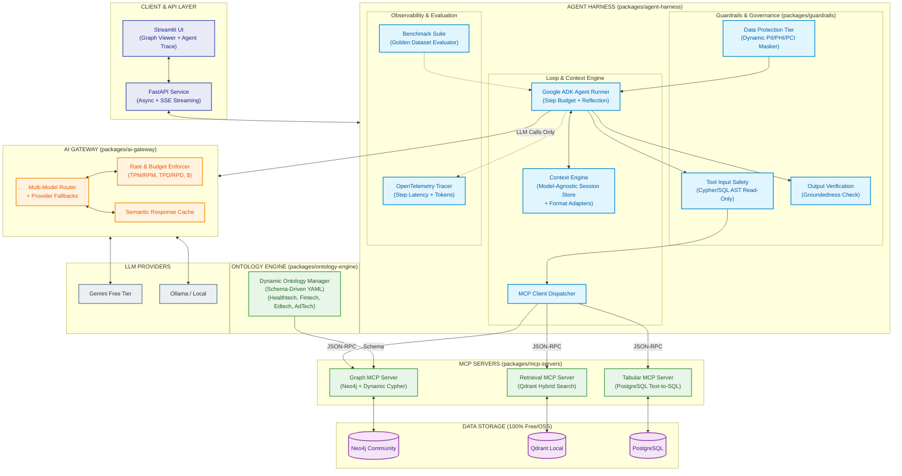

# Cognitive Knowledge Platform Architecture

## Component Flowchart

```mermaid
flowchart TB
    classDef client fill:#E8EAF6,stroke:#3F51B5,stroke-width:2px,color:#1A237E
    classDef harness fill:#E1F5FE,stroke:#0288D1,stroke-width:2px,color:#01579B
    classDef gateway fill:#FFF3E0,stroke:#FB8C00,stroke-width:2px,color:#E65100
    classDef mcp fill:#E8F5E9,stroke:#43A047,stroke-width:2px,color:#1B5E20
    classDef data fill:#F3E5F5,stroke:#8E24AA,stroke-width:2px,color:#4A148C
    classDef model fill:#ECEFF1,stroke:#607D8B,stroke-width:2px,color:#263238

    subgraph ClientLayer ["CLIENT & API LAYER"]
        UI["Streamlit UI\n(Graph Viewer + Agent Trace)"]:::client
        FastAPIApp["FastAPI Service\n(Async + SSE Streaming)"]:::client
        UI <--> FastAPIApp
    end

    subgraph AgentHarness ["AGENT HARNESS (packages/agent-harness)"]
        direction TB
        subgraph GuardrailsEngine ["Guardrails & Governance (packages/guardrails)"]
            PIIMasker["Data Protection Tier\n(Dynamic PII/PHI/PCI Masker)"]:::harness
            ASTValidator["Tool Input Safety\n(Cypher/SQL AST Read-Only)"]:::harness
            FaithGuard["Output Verification\n(Groundedness Check)"]:::harness
        end
        subgraph ExecutionEngine ["Loop & Context Engine"]
            ADKRunner["Google ADK Agent Runner\n(Step Budget + Reflection)"]:::harness
            ContextMgr["Context Engine\n(Model-Agnostic Session Store\n+ Format Adapters)"]:::harness
            MCPClient["MCP Client Dispatcher"]:::harness
        end
        subgraph ObsEval ["Observability & Evaluation"]
            Tracer["OpenTelemetry Tracer\n(Step Latency + Tokens)"]:::harness
            EvalBench["Benchmark Suite\n(Golden Dataset Evaluator)"]:::harness
        end
        PIIMasker --> ADKRunner
        ADKRunner <--> ContextMgr
        ADKRunner --> ASTValidator
        ASTValidator --> MCPClient
        ADKRunner --> FaithGuard
        ADKRunner -.-> Tracer
        EvalBench -.-> ADKRunner
    end

    subgraph AIGateway ["AI GATEWAY (packages/ai-gateway)"]
        Router["Multi-Model Router\n+ Provider Fallbacks"]:::gateway
        RateLimiter["Rate & Budget Enforcer\n(TPM/RPM, TPD/RPD, $)"]:::gateway
        SemCache["Semantic Response Cache"]:::gateway
        Router <--> RateLimiter
        Router <--> SemCache
    end

    subgraph OntologyLayer ["ONTOLOGY ENGINE (packages/ontology-engine)"]
        OntologyEng["Dynamic Ontology Manager\n(Schema-Driven YAML)\n(Healthtech, Fintech, Edtech, AdTech)"]:::mcp
    end

    subgraph MCPLayer ["MCP SERVERS (packages/mcp-servers)"]
        GraphMCP["Graph MCP Server\n(Neo4j + Dynamic Cypher)"]:::mcp
        VectorMCP["Retrieval MCP Server\n(Qdrant Hybrid Search)"]:::mcp
        TabularMCP["Tabular MCP Server\n(PostgreSQL Text-to-SQL)"]:::mcp
    end

    subgraph DataFabric ["DATA STORAGE (100% Free/OSS)"]
        Neo4j[("Neo4j Community")]:::data
        Qdrant[("Qdrant Local")]:::data
        PostgreSQL[("PostgreSQL")]:::data
    end

    subgraph Models ["LLM PROVIDERS"]
        Gemini["Gemini Free Tier"]:::model
        Ollama["Ollama / Local"]:::model
    end

    FastAPIApp <--> AgentHarness
    ADKRunner -- "LLM Calls Only" --> AIGateway
    AIGateway <--> Gemini
    AIGateway <--> Ollama
    MCPClient -- "JSON-RPC" --> GraphMCP
    MCPClient -- "JSON-RPC" --> VectorMCP
    MCPClient -- "JSON-RPC" --> TabularMCP
    OntologyEng -- "Schema" --> GraphMCP
    GraphMCP <--> Neo4j
    VectorMCP <--> Qdrant
    TabularMCP <--> PostgreSQL
```
